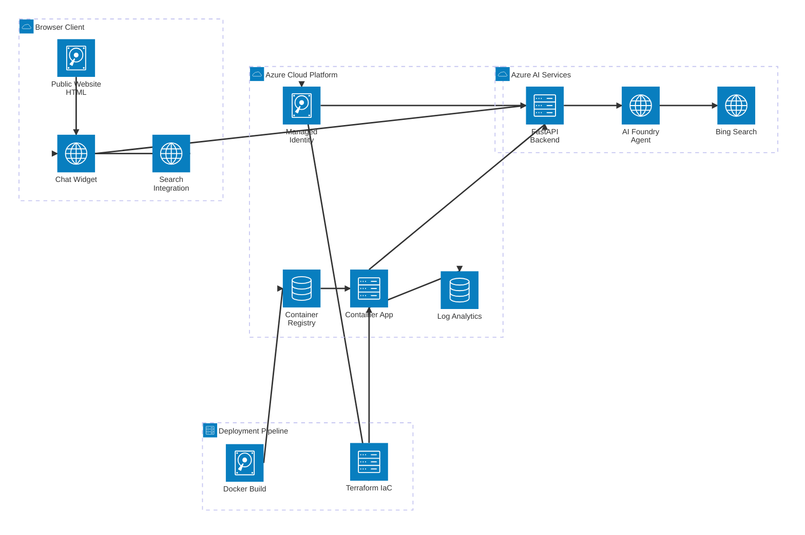

# Public Sector AI Chatbot - Phase 1A Complete + Azure AI Search Integration ✅

## Overview
Phase 1A implementation with **Azure AI Search integration** for a Public Sector AI-powered chatbot. Features working citations, dual-agent system (AI Search + Bing), floating widget, FastAPI backend, and production-ready deployment.

## ✅ Current Status: FULLY FUNCTIONAL
- **Public Documents** indexed in Azure AI Search
- **Working Citations** with real  document URLs
- **Dual-Agent System** (AI Search primary, Bing fallback) 
- **URL Mapping** from document IDs to actual public URLs
- **Production Ready** with Docker and Terraform deployment

## What's Been Built

### ✅ Completed Features
1. **Fixed HTML Links** - All local HTML pages now link to each other correctly
2. **FastAPI Backend** - RESTful API with chat and search endpoints
3. **Azure AI Search Integration** - Public documents indexed with working citations
4. **Dual-Agent System** - Primary (AI Search) + Fallback (Bing) agents
5. **Working Citations** - Real public document URLs instead of "doc_0" placeholders
6. **URL Mapping Utility** - Automated document ID to URL resolution
7. **Floating Chat Widget** - Responsive, accessible, resizable chat interface
8. **Dual Modes** - Chat mode (conversational) and Search mode (results list)
9. **Conversation Persistence** - Thread continuity with localStorage and "Clear conversation"
10. **Native Search Integration** - Existing search forms now trigger widget search
11. **Enhanced Citations** - Card-style citation display with visual hierarchy
12. **Resizable Widget** - Drag to resize, supports full-screen mode
13. **Request Logging** - Enhanced debugging and monitoring capabilities
14. **Production Deployment** - Docker containerization with Terraform IaC

## Project Structure

```
va-chat/
├── backend/
│   ├── main.py                      # FastAPI server with dual-agent system
│   └── foundry-agent/               # Agent configuration files
├── frontend/
│   ├── va-chat-widget.css          # Widget styles
│   └── va-chat-widget.js           # Widget JavaScript
├── utilities/
│   ├── mapping.csv                  # Document ID to URL mappings
│   └── map_sourceurl2_foundryIQ_kstore.py  # Azure AI Search mapping utility
├── sample-site/
│   ├── *.html                       # Local mocked up public website pages
│   ├── va-chat-widget.css          # Widget styles (deployed)
│   ├── va-chat-widget.js           # Widget JavaScript (deployed)
│   ├── va-search-integration.js    # Native search integration
│   └── test-chat-widget.html        # Integration test page
├── scripts/
│   ├── fix-links.py                 # HTML link fixer
│   ├── serve-site.py                # Development HTTP server
│   ├── build-and-push.ps1          # Docker build and push (Windows)
│   └── build-and-push.sh           # Docker build and push (Linux)
├── terraform/
│   ├── main.tf                      # Infrastructure as Code
│   ├── variables.tf                 # Terraform variables
│   └── outputs.tf                   # Terraform outputs
├── experiments/
│   └── agent-playground.py          # Azure AI Foundry SDK example
├── .env                             # Environment variables
├── requirements.txt                 # Python dependencies
└── Dockerfile                       # Container image definition
```

## Getting Started

### Prerequisites
- Python 3.11+
- Azure CLI (authenticated with `az login`)
- Azure AI Foundry agent configured

### Installation

1. **Activate virtual environment**
   ```powershell
   .\.venv\Scripts\Activate.ps1
   ```

2. **Install dependencies** (if not already installed)
   ```powershell
   pip install -r requirements.txt
   ```

3. **Configure environment variables**
   
   Ensure `.env` file has these values set:
   ```
   AZURE_FOUNDRY_PROJECT_ENDPOINT=your-endpoint
   AZURE_FOUNDRY_AGENT_ID=your-primary-agent-id
   AZURE_FOUNDRY_FALLBACK_AGENT_ID=your-fallback-agent-id
   PORT=8080
   LOG_LEVEL=INFO
   ```

### Running the Application

You need **two terminals** running simultaneously:

#### Terminal 1: FastAPI Backend
```powershell
cd backend
python main.py
```
- Runs on: `http://localhost:8080`
- Provides: `/api/chat` and `/api/search` endpoints

#### Terminal 2: Site HTTP Server
```powershell
python scripts\serve-site.py
```
- Runs on: `http://localhost:9000`
- Serves: Local HTML pages with chat widget

### Testing

1. **Open your browser** to one of these URLs:
   - Test page: http://localhost:9000/test-chat-widget.html
   - Home page: http://localhost:9000/index.html
   - Services: http://localhost:9000/services.html

2. **Click the chat button** (💬) in the bottom-right corner

3. **Try these test queries**:
   - "What services do you provide?"
   - "How do I apply for a job?"
   - "Tell me about public education programs"

4. **Test both modes**:
   - Chat mode: Conversational responses with citations
   - Search mode: List of search results

## API Endpoints

### POST `/api/chat`
Send a chat message to the agent.

**Request:**
```json
{
  "message": "What services are available?",
  "thread_id": "optional-thread-id",
  "mode": "chat"
}
```

**Response:**
```json
{
  "message": "The organization provides...",
  "thread_id": "thread_abc123",
  "mode": "chat",
  "citations": [
    {
      "title": "Our Services",
      "url": "https://example.gov",
      "snippet": "..."
    }
  ]
}
```

### POST `/api/search`
Search mode alias (same as `/api/chat` with `mode: "search"`).

### GET `/api/health`
Health check endpoint.

## Integration Guide

To add the chat widget to any HTML page:

```html
<!DOCTYPE html>
<html>
<head>
    <!-- VA Chat Widget CSS (in head) -->
    <link rel="stylesheet" href="frontend/va-chat-widget.css">
</head>
<body>
    <!-- Your page content -->
    
    <!-- VA Chat Widget JS (before closing body tag) -->
    <script src="frontend/va-chat-widget.js"></script>
    <!-- Optional: Native search integration (if page has search forms) -->
    <script src="frontend/va-search-integration.js"></script>
</body>
</html>
```

The widget will automatically initialize and appear in the bottom-right corner.

**Note:** If your page includes search forms (`<form class="search">`), the search integration script will automatically connect them to the chat widget, providing a seamless search experience.

## Architecture

### System Architecture Diagram



### Component Details

#### **Frontend Layer (Browser)**
- **Chat Widget** (`va-chat-widget.js`) - Floating, responsive UI component
- **Public Website** - Local HTML pages with integrated widget
- **Search Integration** (`va-search-integration.js`) - Connects native search forms to widget

#### **Backend Layer (Azure Container Apps)**
- **FastAPI Server** (`main.py`) - RESTful API with `/api/chat` and `/api/search` endpoints
- **Managed Identity** - Secure authentication to Azure AI services (no API keys)
- **Log Analytics** - Centralized logging and monitoring

#### **AI Services Layer**
- **Azure AI Foundry Agent** - Conversational AI agent with custom grounding
- **Bing Search Integration** - Real-time web search capabilities for current information
- **Citations & Context** - Automatic source attribution and context management

#### **Deployment Pipeline**
- **Docker** - Containerized application with `Dockerfile`
- **Azure Container Registry** - Private image repository
- **Terraform** - Infrastructure as Code for reproducible deployments

### Authentication Flow


### Data Flow

#### Chat Mode
1. User types message in widget
2. Widget sends POST request to `/api/chat` with message and thread_id
3. FastAPI creates/continues conversation thread in AI Foundry
4. AI Foundry Agent processes message with Bing Search grounding
5. Response includes conversational text + citations
6. Widget displays message with citation cards

#### Search Mode
1. User enters search query (in widget or native search form)
2. Widget sends POST request to `/api/search`
3. FastAPI appends search instructions to query
4. AI Foundry returns comprehensive search results with URLs
5. Widget displays traditional search result list format

## Authentication Flow

- **Local Development**: Uses `DefaultAzureCredential` with Azure CLI (`az login`)
- **Production**: Will use Managed Identity (Azure Container Apps)
- **No API Keys**: All authentication through Entra ID

## Features in Detail

### Chat Widget
- **Floating bubble**: Minimizes to corner icon
- **Expand/collapse**: Smooth animations
- **Responsive**: Works on mobile and desktop
- **Accessible**: WCAG 2.1 AA compliant
- **Thread persistence**: Remembers conversation across page loads

### Modes
- **Chat Mode** (💬): Natural conversation with citations
- **Search Mode** (🔍): Structured search results with links

### Native Search Integration
The widget automatically integrates with existing search forms on the web pages:
- **Intercepts search submissions**: All `form.search` elements are connected to the chat widget
- **Opens widget automatically**: When users submit a search query, the widget opens in search mode
- **Seamless UX**: No page reload needed - results appear in the chat widget
- **Fixes broken search**: Native site search is non-functional; chat widget provides working alternative

**How it works:**
1. User types query in native search box and clicks search
2. `va-search-integration.js` intercepts the form submission
3. Widget opens automatically in search mode
4. Query is sent to Azure AI agent with Bing Search grounding
5. Results displayed in traditional search result format with URLs

### Backend
- **FastAPI**: High-performance async Python
- **Azure AI SDK**: Direct integration with AI Foundry
- **CORS enabled**: For local development
- **Error handling**: Graceful failure with user feedback

## Deployment

The project includes complete Terraform infrastructure-as-code for deploying to Azure Container Apps.

### Quick Deploy

1. **Configure Terraform**
   ```powershell
   cd terraform
   Copy-Item terraform.tfvars.example terraform.tfvars
   notepad terraform.tfvars  # Edit with your values
   ```

2. **Build and Push Docker Image**
   ```powershell
   cd ..
   .\scripts\build-and-push.ps1
   ```

3. **Deploy Infrastructure**
   ```powershell
   cd terraform
   terraform init
   terraform apply
   ```

See [DEPLOYMENT.md](DEPLOYMENT.md) for detailed deployment instructions.

### Deployment Resources

- **Terraform Configuration**: `terraform/` directory
  - Provisions Azure Container Registry
  - Creates Container App Environment
  - Deploys Container App with managed identity
  - Configures Log Analytics workspace

- **Build Scripts**: `scripts/` directory
  - `build-and-push.ps1` - PowerShell (Windows)
  - `build-and-push.sh` - Bash (Linux/macOS)
  - Automated Docker build, tag, and push to ACR

- **Documentation**:
  - [DEPLOYMENT.md](DEPLOYMENT.md) - Complete deployment guide
  - [terraform/README.md](terraform/README.md) - Terraform configuration reference
  - [scripts/README.md](scripts/README.md) - Build script documentation

## Next Steps (Phase 1B & Beyond)

- [x] **Azure AI Search integration** ✅ COMPLETE
- [x] **Citation system with real URLs** ✅ COMPLETE  
- [x] **Docker containerization** ✅ COMPLETE
- [x] **Azure Container Apps deployment with Terraform** ✅ COMPLETE
- [x] **Automated build and push scripts** ✅ COMPLETE
- [x] **URL mapping utility for documents** ✅ COMPLETE
- [ ] Enhanced search result formatting and ranking
- [ ] CI/CD pipeline with GitHub Actions
- [ ] User authentication (Phase 2)
- [ ] M365 Agent SDK integration  
- [ ] Multi-channel support (Teams, etc.)
- [ ] Performance optimization and caching
- [ ] Analytics and usage tracking

## Troubleshooting

### Backend won't start
- Check Azure CLI authentication: `az account show`
- Verify `.env` file has correct endpoint and agent ID
- Ensure port 8080 is not in use

### Widget doesn't appear
- Check browser console for errors
- Verify FastAPI is running on port 8080
- Check CORS settings if using different origin

### Chat not responding
- Check FastAPI logs in terminal
- Verify agent ID is correct
- Test agent directly with `experiments/agent-playground.py`

### Links not working
- Run `python scripts/fix-links.py` to update HTML files
- Ensure all HTML files are in the `site/` directory

## Scripts

### `scripts/fix-links.py`
Updates all HTML files to use local file paths instead of westerncape.gov.za URLs.

```powershell
python scripts/fix-links.py
```

### `scripts/serve-site.py`
Serves the site directory on port 9000 for testing.

```powershell
python scripts/serve-site.py
```

## Development Tips

1. **Auto-reload**: FastAPI runs with `--reload` flag, changes are applied automatically
2. **Thread IDs**: Stored in browser localStorage, clear to start fresh conversation
3. **Mode switching**: Can switch between chat/search mid-conversation
4. **Styling**: All widget styles in `frontend/va-chat-widget.css`, easy to customize

## Support

- **Agent Testing**: Use `experiments/agent-playground.py` to test agent directly
- **API Testing**: Use FastAPI docs at `http://localhost:8080/docs`
- **Logs**: Check terminal output for detailed error messages

---

**Status**: Phase 1A Complete + Azure AI Search Integration ✅  
**Last Updated**: November 20, 2025  
**Version**: 1.1.0

